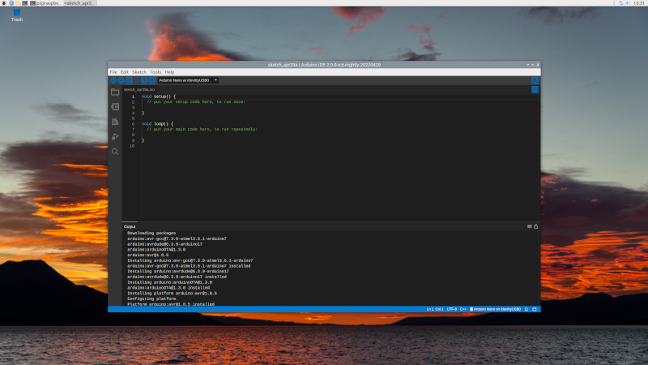
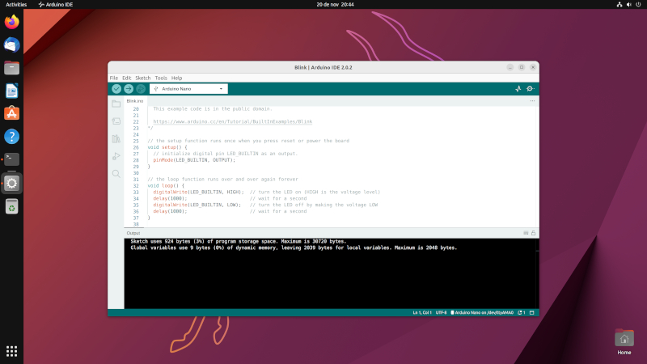

# arduino-ide 2.0.0 for Raspberry Pi

[](https://github.com/koendv/arduino-ide-raspberrypi/raw/main/images/screenshot.jpg)

This is [arduino-ide 2](https://github.com/arduino/arduino-ide) compiled for raspberry pi os 64-bit and ubuntu bionic arm64.

## Installation on Raspberry Pi OS 64-bit

arduino-ide 2.0 is available as appimage.

Home directory on external usb disk recommended; home directory on internal sd card can be painfully slow.

To install, download and run the latest appimage from [releases](https://github.com/koendv/arduino-ide-raspberrypi/releases/).

## Forum

The official forum for discussion of arduino ide 2.0 is [here](https://forum.arduino.cc/c/software/arduino-ide-2-0/).

## Installation on Ubuntu arm64

[](https://github.com/koendv/arduino-ide-raspberrypi/raw/main/images/ubuntu.jpg)

This appimage runs not only on raspberry pi os 64-bit, but also on ubuntu arm64. 
To run the appimage on ubuntu-arm64 first install libz and fuse:
```sh
sudo apt-get install libz1g-dev fuse libfuse-dev
```
and reboot. Then download and install the appimage.

## Developers

Compilation notes are in [README-DEVELOPER.md](README-DEVELOPER.md)

If you like this, maybe you want to buy me a cup of tea:

[](https://ko-fi.com/Q5Q03LPDQ)

not truncated.
